# Thirsty Wine

## Introduction
 A web application designed to cater to wine enthusiasts, offering them a platform to discover a wide array of wines, delve into their unique characteristics, and exchange insights and experiences. Users can seamlessly browse through diverse wines, access comprehensive details about each selection, and engage with fellow enthusiasts through comments and ratings. Additionally, the platform incorporates user-friendly features such as a shopping cart function, wishlist, catalogue , and robust authentication mechanisms for signup and login and also and an admin page.

## Project Type
Fullstack

## Deplolyed App
[Live Demo Frontend](https://pay-pal-pioneers-068.vercel.app/)<br>
[Live Demo Backend]( https://paypal-pioneers-068.onrender.com/)


## Directory Structure
PayPal Pioneers/<br>
├─ Backend/<br>
│ ├─...<br>
├─ screenshots/<br>
│ ├─...<br>
├─ Frontend/<br>
│ ├─public<br>
│ ├─src<br>
│ │ ├─assets<br>
│ │ │ ├─...<br>
│ │ ├─components<br>
│ │ │ ├─authentication<br>
│ │ │ │ ├─...<br>
│ │ │ ├─catlog<br>
│ │ │ │ ├─...<br>
│ │ │ ├─context<br>
│ │ │ │ ├─...<br>
│ │ │ ├─dashboard<br>
│ │ │ │ ├─...<br>
│ │ │ ├─...<br>
│ │ ├─hooks<br>
│ │ │ ├─...<br>
│ │ ├─images<br>
│ │ │ ├─...<br>
│ │ ├─redux<br>
│ │ │ │ ├─Actions<br>
│ │ │ │ │ ├─...<br>
│ │ │ │ ├─...<br>
│ │ │ ├─...<br>
│ │ ├─styles<br>
│ │ │ ├─...<br>
│ ├─...<br>


## Video Walkthrough of the project
https://youtu.be/3rAc2uPaI50

# List out the key features of our application.

- Wine browsing
- Wine details view
- User comments and ratings
- User-friendly website design
- Shopping cart functionality
- Search functionality
- User signup and login
- Filtration functionality 
- Wishlist functionality
- Admin Dashboard (CRUD operation on products)

## Tech Stack

- **HTML**: Provides the structure and content for the web page.
- **CSS**: Handles the UI and styling, ensuring an appealing visual presentation.
- **Bootstrap**:  Front-end framework for responsive, mobile-first web design with pre-designed components and powerful layout grid system.
- **Javascript**: Dynamic scripting language for web development, interactive UIs, server-side applications
- **Create React App (CRA)**: Toolchain for setting up a modern React web app environment with no configuration needed.
- **Vite**: Front-end build tool that provides a faster and leaner development experience for modern web projects.
- **ChakraUI**: React component library for building accessible, reusable UI components with a simple, modular and customizable design system.
- **JSON Server**: Lightweight tool to set up a fake REST API with JSON files for prototyping or testing front-end projects.


## How to Use/Run
To run this project you need to have node packet manager ```npm``` From more [info](https://docs.npmjs.com/downloading-and-installing-node-js-and-npm)
1. Clone this repository to your local machine.
2. Go inside the Frontend directory and do ```npm install```
3. Install other dependencies ```npm install @chakra-ui/react @emotion/react @emotion/styled framer-motion axios react-redux recharts redux redux-thunk```
4. After installation dependency type ```npm run dev``` or ```vite```
5. Explore the Thirsty Wine website  experience right from your device.


## Screenshots

### Desktop view
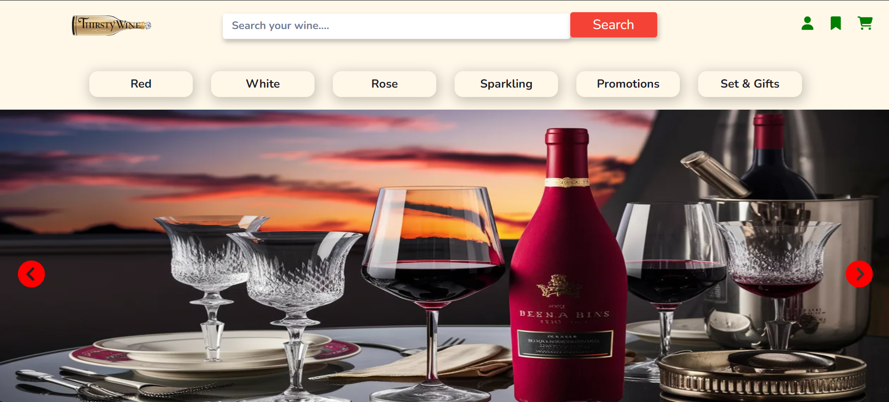
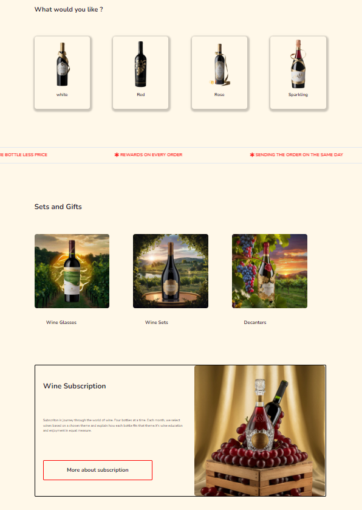
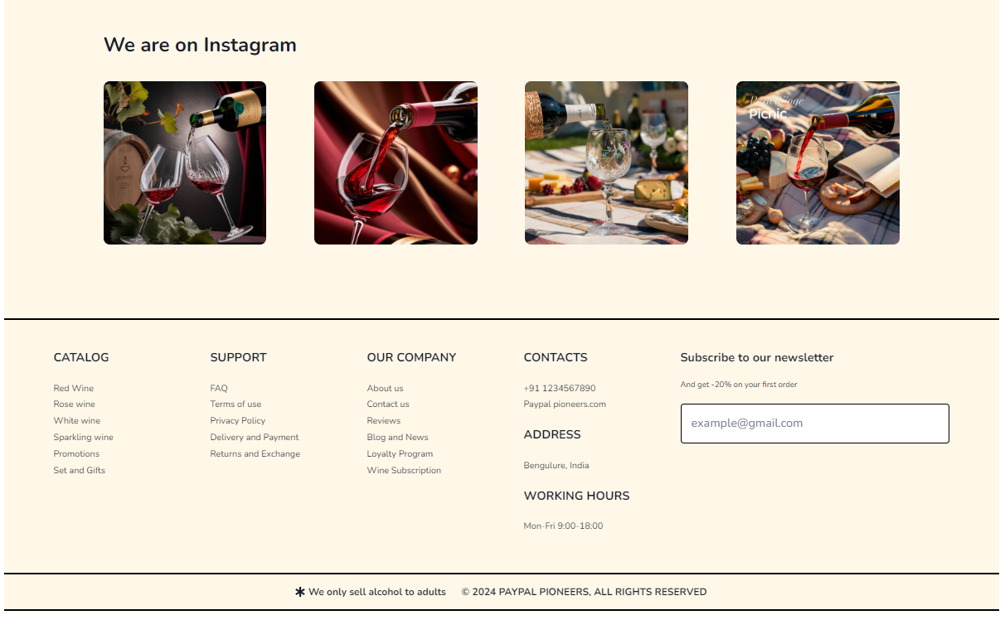
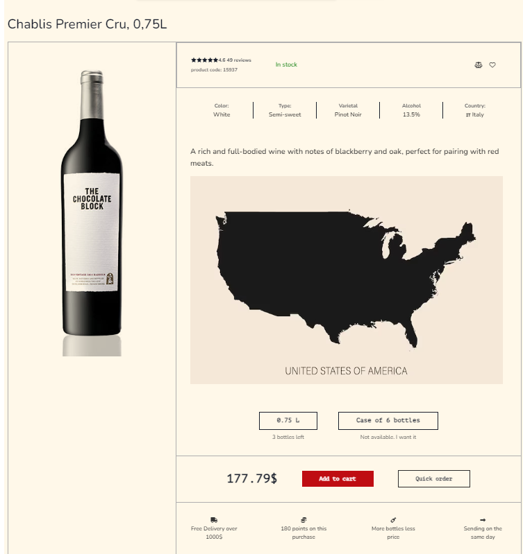
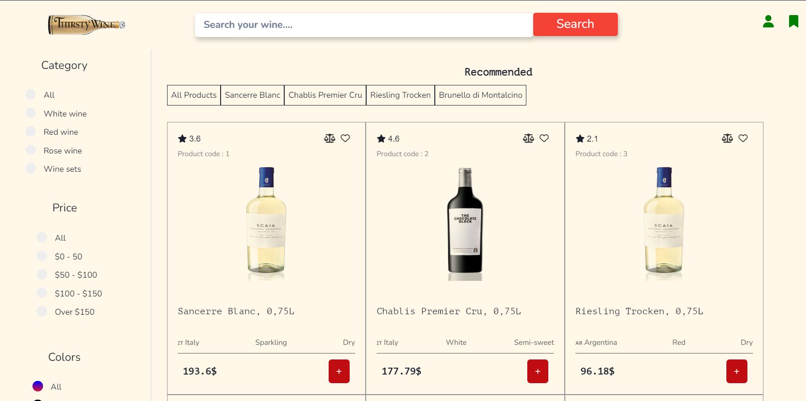
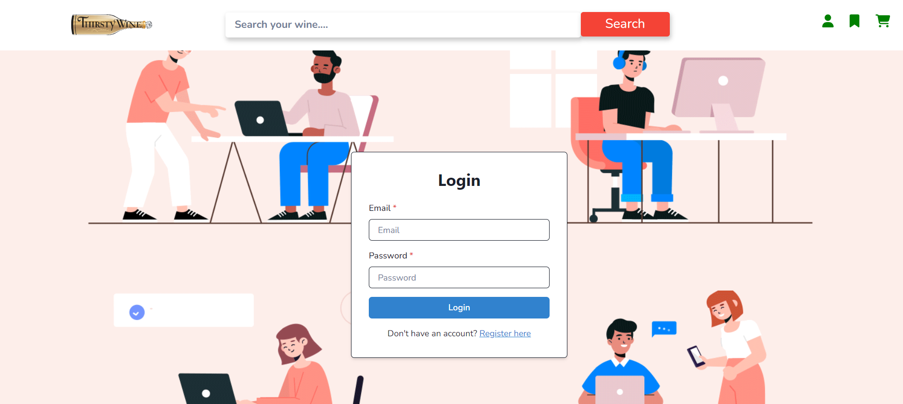
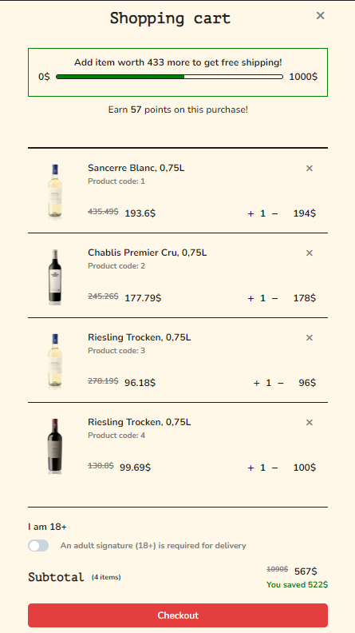
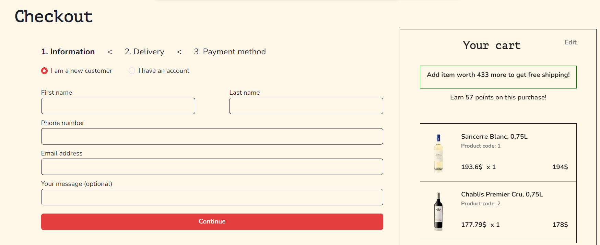

### Mobile view
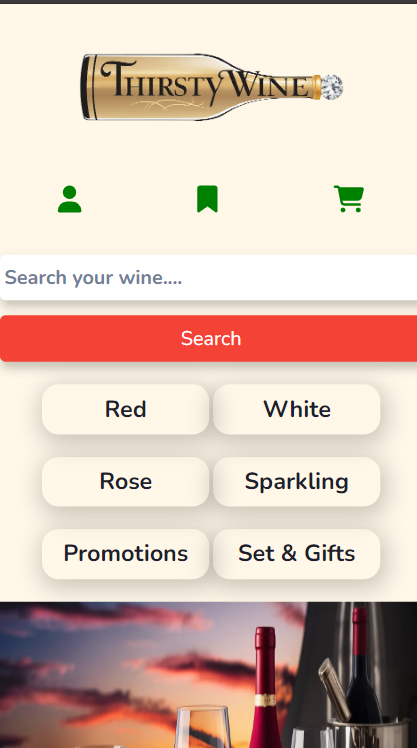
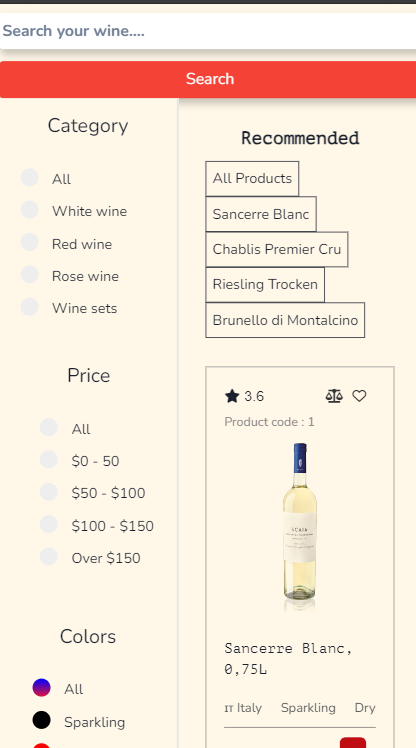
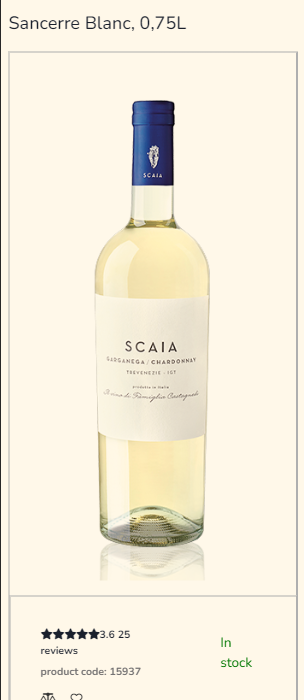
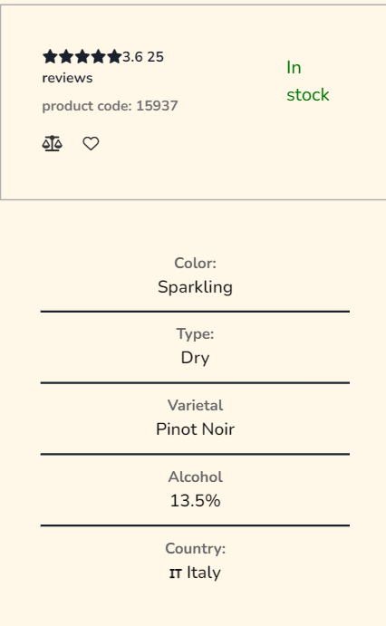
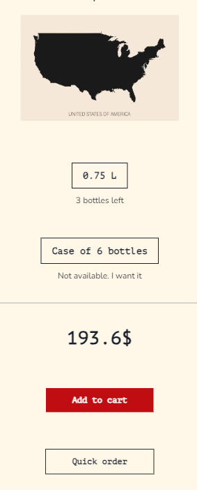
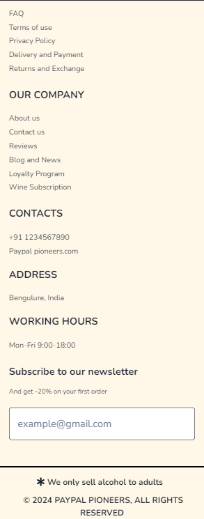

## API Used/Endpoints

Data Servers: - https://paypal-pioneers-068.onrender.com/

In case of Backend Applications provide a list of your API endpoints, methods, brief descriptions, and examples of request/response.
GET /api/items - retrieve all items
POST /api/items - create a new item
PUT /api/items - update particular data

## Contributors

- [Aditya Kumar Ashwini](https://github.com/Adit704)
- [Aditya Kumar Singh](https://github.com/adityaks-lts)
- [Abdulla Abdul Azeez](https://github.com/Abdullaabdulazeez)
- [Thakoor Rishwanth](https://github.com/ThakoorRishwanth)
- [Junaid Khan](https://github.com/Junaidify)

## License

This project is licensed under the MIT License - see the [LICENSE](LICENSE) file for details.

## Acknowledgments

- Inspired by [Wine Store - E-COMMERCE layout](https://www.behance.net/gallery/166779751/Wine-Store-E-COMMERCE?tracking_source=search_projects).
